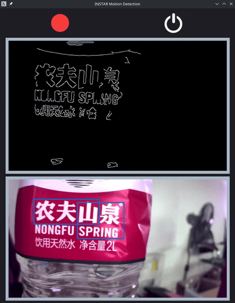

# INSTAR IP Camera Motion Detector

Using Python OpenCV and PyQT to detect motion in an [RTSP video stream](https://github.com/mpolinowski/opencv-rtsp) and display/highlight detected moving objects:

